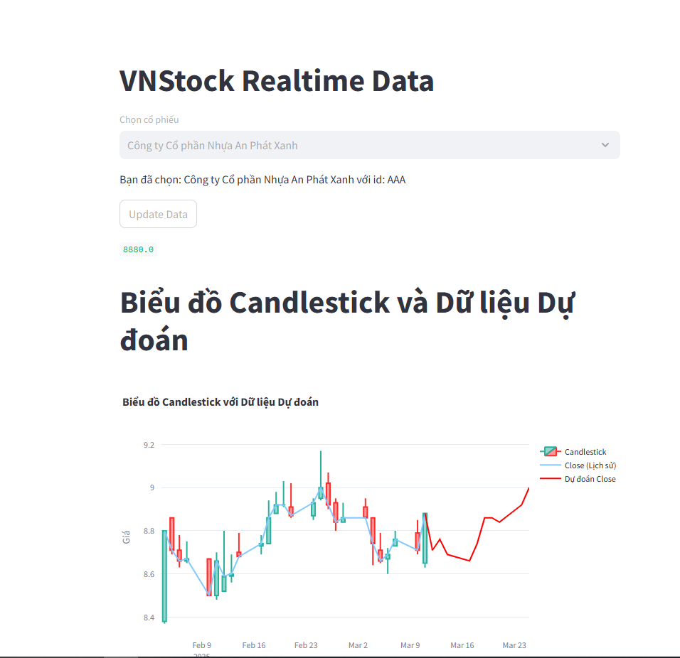

# Linear-Regression-for-Stock-Trend-Prediction-with-time-series-data
This respository, I will implement prediction stock trend with Linear Regression using data from vnstock library

## Demo


## Installation
1. Run install package requirements

```bash
pip install -r requirements.txt
```

2. Run code demo streamlit

```bash
streamlit run app/main.py
```


## Q/A
## Contribute